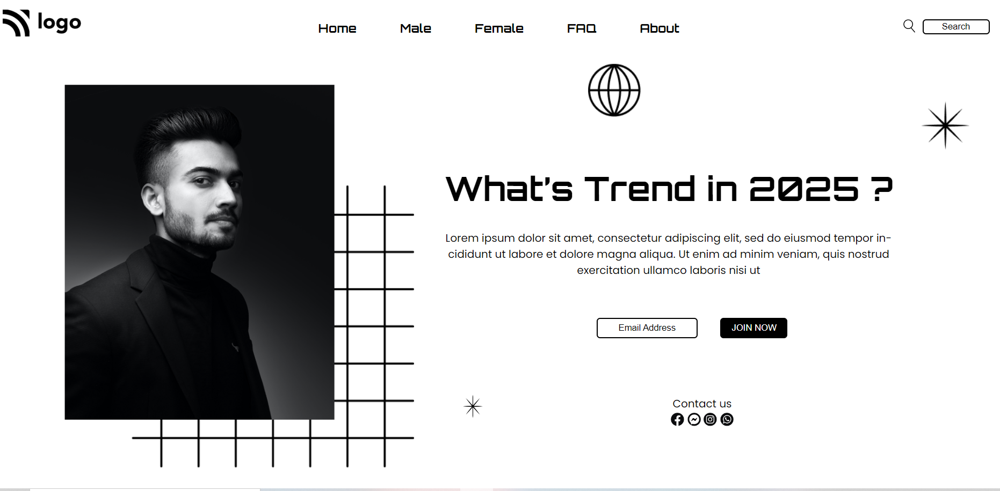

# Pratiksha Taank

***
## Technogy Used
- HTML
- CSS
## Screenshot

## What I have learn in this project
I have learn about HTML tags, structure of HTML and how to make a web page beautiful with some properties of CSS like positioning and z-index.
## Honest Time Spent
I spent 5 hours to complete this project
## Live Link
You can preview the project [Here]()